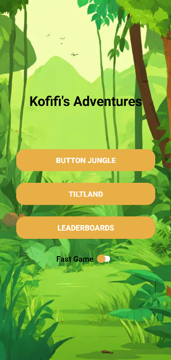
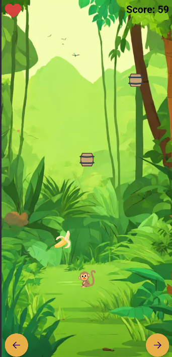
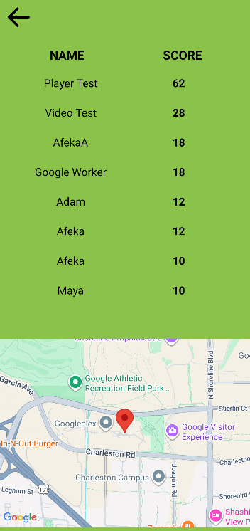

# Kofifi's Adventures 🐒

## Overview
Kofifi's Adventures is an Android application where the player controls a monkey to collect bananas while avoiding falling barrels. The game features multiple input methods and location-based scoring.

## Features
* **Dual Control Modes**: Players can choose between on-screen buttons or physical device tilting (using the accelerometer).
* **Dynamic Speed**: Includes a "Fast Mode" toggle to increase game difficulty.
* **Sound Effects**: Custom audio for collisions and collecting bananas.
* **Location-Aware Leaderboards**: High scores are saved with the player's name and GPS coordinates.
* **Interactive Map**: Clicking a high score on the leaderboard zooms into the specific location where that score was achieved.

## App Flow & Views

### 1. Main Menu
The entry point where you configure your game settings.

### 2. Gameplay
The active game screen showing lives (hearts), score, the game grid and the movement buttons (unless playing on Tiltland).

### 3. Score
Triggered after losing the game, this view shows your total score (distance moved + bananas eaten).

### 4. Name Entry
Triggered after the Game Over view, this view captures your name and fetches your current location.

### 5. Leaderboard & Map
A split-screen view showing the top scores and a Google Map with the option to return to the main menu via the arrow button.
